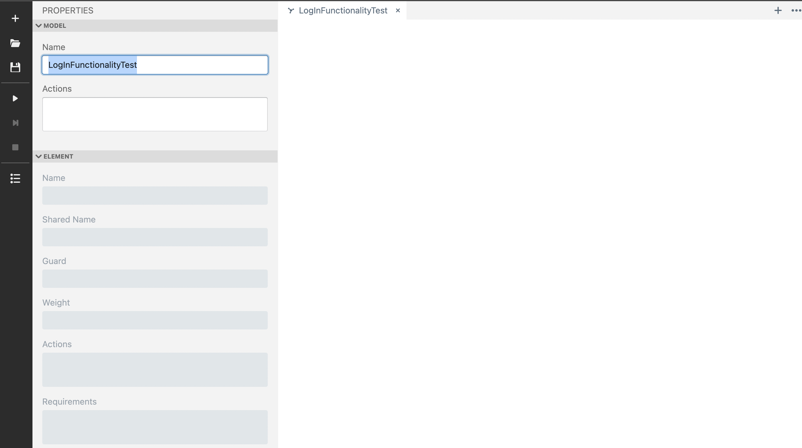
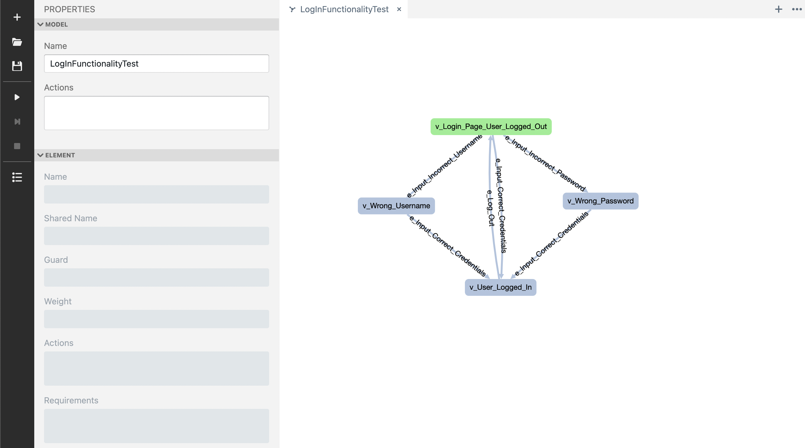
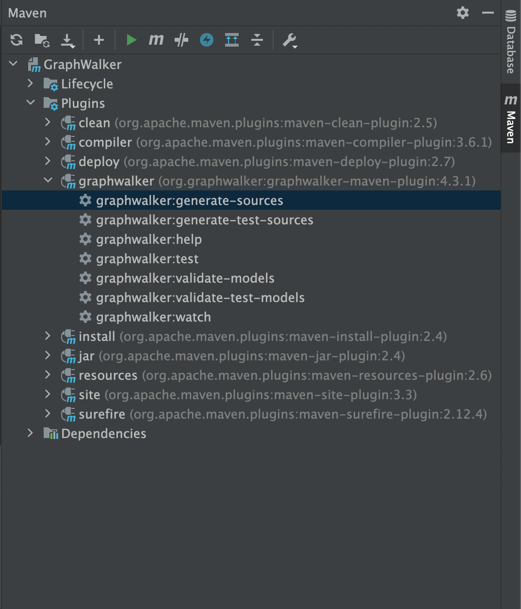

Näide mudelipõhisest testimisest Graphwalkeril sisselogimise funktsionaalsusest.

Kaustas ``src/main/java/com/User`` on java fail LoginFunctionality, kus on lihtne näitekood sisselogimise
funktsionaalsusest. 

Meie esimeseks eesmärgiks on koodiga tutvuda ning sellest teha süsteemi kirjeldav mudel. 
Koodiga tuvudes näeme, et esialgses olekus on kasutaja väljalogitud olekus. Edasi on kolm varianti:
1. Kasutaja sisestab vale kasutajanime ja saab vastava veateate
2. Kasutaja sisestab vale parooli ja saab vastava veateate
3. Kasutaja sisestab õiged sisselogimisandmed, saab vastava veateate ning kasutaja olek muutub sisselogituks

Lisaks saab kasutaja ka välja logida ning jõuab nii tagasi esialgsesse olekusse. Kuna tegemist on väga lihtsa koodiga,
et näidata mudelipõhise testimise toimimist, siis on koodi järgi lubatud sisse logida ainult ühe kasutajanime ja parooliga:
``username_ = "Kasutajanimi";
password_ = "õigeParool123";``

Teeme nüüd sellest GraphWalkeril mudeli:

Selleks paneme tööle graphwalker studio, mis on meil juba alla laetud: 
`$ java -jar ../lib/graphwalker-studio-4.3.1.jar` ja avame studio brauseris: http://localhost:9090/studio.html.

Valime vasakult tööriista ribalt uue faili `+` märgist, kuhu hakkame oma mudelit looma:


Avame ka vasakult alt menüüst ``Properties`` paneeli ja muudame `"Model" -> "Name"` väljas mudeli nimeks 
"LoginFunctionalityTest".


Järgmisena loome vastavalt koodile 4 võimalikku olekut ehk tippu ja nende vahele tegevused ehk kaared. Graphwalkeril 
tähistab "vertex" tippu ning "edge" on suunatud kaar. Et luua tipp, hoia all klahvi ``v`` ning tee hiireklõps mudelifailil.
Kahe tipu vahele kaare loomiseks tuleb hoida all klahvi `e` ning tõmmata hiirega ühest tipust teise (suund on oluline).
Et ümbernimetada mudeli element, vajuta sellele ning muuda see `Properties` paneelil  `"Element" -> "Name"` välja all. 
Tulemus peaks olema selline:


Oluline on see, et tipul ``v_Login_Page_User_Logged_Out`` oleks sisse lülitatud `Properties` paneelil `"Element" -> "Start element"`,
see tähistab algolekut. Lõppolekuid meil ei ole, küll aga on test tee generaator, kus saab kirja panna, mis reegliga 
mudelit läbima peab. See asub `Properties` paneelil all: `"Execution" -> "Generator"`. Vaikimisi on seal olemas `random(edge_coverage(100))`,
mis tähistab reeglit, et läbime mudelit valides juhusliku kaare, lõpetades töö, kui kõik kaared on läbitud. Jätamegi selle 
reegli sinna nii. Kontrollime, kas mudelit on võimalik läbida vajutades vasakul tööriista ribalt `play` nuppu.

Kui kõik toimib, siis vajuta vasakult ribalt ``save`` nuppu. Mudeli kirjeldus json failis salvestatakse "test.json" failina
arvuti Downloads kausta. Muuda faili nimeks "LoginFunctionality.json" ning tõsta ta projektis `src/resources/com/loginExample` 
kausta. 

Järgmisena genereerime mudelist liidese (interface klassi) graphwalkeri abil: ava intellij projekti paremalt äärest Maven
ja sealt pane tööle ``Graphwalker > Plugins > graphwalker > graphwalker:generate-sources``. 

Genereeritud liidese klassi leiab teelt ``target/generated-sources/graphwalker/com/loginExample/LogInFunctionalityTest.java``.

Nüüd saame hakata lõpuks automaatselt genereeritud test teedesse teste kirjutama. Selleks avame klassi 
``src/main/java/com/LoginTest``. Antud klassis on juba vajalikud impordid ja Graphwalkeri annotatsioon olemas. Et saada 
vajalikud testid, peame implementeerima genereeritud liidese ja selle meetodid. Olek ehk 'vertex' tähistab kontrolli ning
kaar ehk 'edge' tähistab tegevust. Sellepärast on meil ka mudeli elementide nimedel ees vastavalt "e" või "v" täht, et 
teaksime, mida teha. Alustame algolekust ehk ``v_Login_Page_User_Logged_Out``. Esmalt loome seal `User` isendi.
Seejärel tahame kontrollida, et kasutaja oleks välja logitud olekus ning süsteem output oleks "Välja logitud". Väljastame
ekraanile ka oodatud ja tegelikud vastused. Kuna süsteemi outputi peaksime kontrollima igas olekus, on hea tava teha selle
jaoks eraldi meetod. Nüüdseks võiks meie koodis olla järgnev muudatus: 

``` 
private void checkOutput(String expected){
        String actual = user.output;
        System.out.printf("expected: %s, actual: %s).\n", expected, actual);
        assertEquals(expected, actual);
    }

@Override
    public void v_Login_Page_User_Logged_Out() {
        user = new User();
        System.out.printf("expected: %s, actual: %s).\n", false, user.isLoggedIn());
        assertFalse(user.isLoggedIn());
        String expected = "Välja logitud";
        checkOutput(expected);
    }    
```

Ülejäänud käib tegelikult suhteliselt analoogselt ja võiksite proovida koodi ise lõpuni lahendada.

Aga lahendus on siin:

```
@GraphWalker(value = "random(edge_coverage(100))", start = "v_Login_Page_User_Logged_Out")
public class LoginTest extends ExecutionContext implements LogInFunctionalityTest {

    User user;

    private void checkOutput(String expected){
        String actual = user.output;
        System.out.printf("expected: %s, actual: %s).\n", expected, actual);
        assertEquals(expected, actual);
    }

    @Override
    public void e_Input_Correct_Credentials() {
        user.inputCredentials( "Kasutajanimi", "õigeParool123");
    }

    @Override
    public void v_Wrong_Username() {
        String expected = "Vale kasutajanimi!";
        checkOutput(expected);
    }

    @Override
    public void e_Input_Incorrect_Username() {
        user.inputCredentials( "valeKasutajanimi", "õigeParool123");
    }

    @Override
    public void e_Log_Out() {
        user.logOut();
    }

    @Override
    public void v_Wrong_Password() {
        String expected = "Vale parool!";
        checkOutput(expected);
    }

    @Override
    public void v_Login_Page_User_Logged_Out() {
        user = new User();
        System.out.printf("expected: %s, actual: %s).\n", false, user.isLoggedIn());
        assertFalse(user.isLoggedIn());
        String expected = "Välja logitud";
        checkOutput(expected);
    }

    @Override
    public void e_Input_Incorrect_Password() {
        user.inputCredentials( "Kasutajanimi", "valeParool");
    }

    @Override
    public void v_User_Logged_In() {
        System.out.printf("expected: %s, actual: %s).\n", true, user.isLoggedIn());
        assertTrue(user.isLoggedIn());
        String expected = "Sisse logitud";
        checkOutput(expected);

    }
}
```

Paneme nüüd graphwalkeriga testid ka tööle. Samamoodi nagu enne Maveni alt, vajutame 
``Graphwalker > Plugins > graphwalker > graphwalker:test``. Tulemuseks on aknas järgmine:
```
{
  "totalFailedNumberOfModels": 0,
  "totalNotExecutedNumberOfModels": 0,
  "totalNumberOfUnvisitedVertices": 0,
  "verticesNotVisited": [],
  "totalNumberOfModels": 1,
  "totalCompletedNumberOfModels": 1,
  "totalNumberOfVisitedEdges": 6,
  "totalIncompleteNumberOfModels": 0,
  "edgesNotVisited": [],
  "vertexCoverage": 100,
  "totalNumberOfEdges": 6,
  "totalNumberOfVisitedVertices": 4,
  "edgeCoverage": 100,
  "totalNumberOfVertices": 4,
  "totalNumberOfUnvisitedEdges": 0
}
```

Uurides tulemust, näeme et Graphwalker läbis koodi ja mudelit nii, et ühtegi viga ei leitud. Muudame nüüd algkoodi, et 
võiks mingi viga tekkida ja jooksutame uuesti teste. Näiteks nii:

```
 public void inputCredentials(String username, String password){
        if (!username.equals(username_)) {
            output = "Vale kasutajanimi!";
        }
        else if (!password.equals(password_)) {
            output = "Vale parool!";
        } else {
            output = "Sisse logitud";
            //loggedIn = true;
        }
        System.out.println(output);
    }
```

Kohe näeme, et on mingid testid on läbi kukkunud. 


