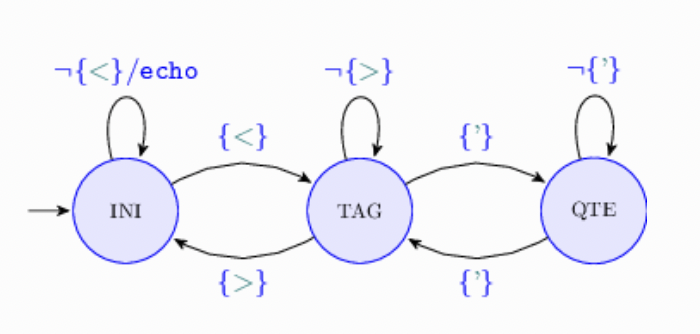
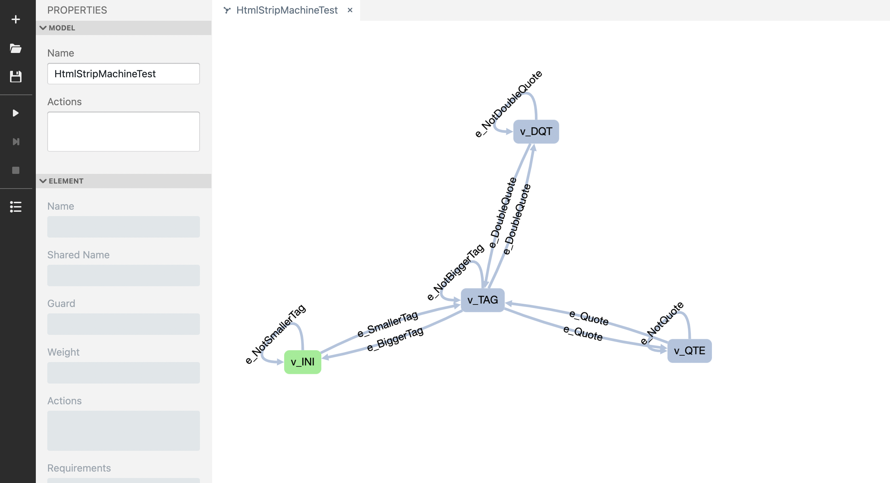
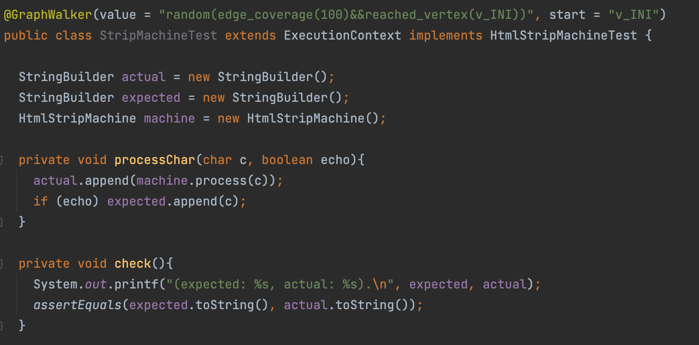

### Näide mudelipõhisest testimisest Graphwalkeril olekumasinate vaatest

https://courses.cs.ut.ee/t/akt/Main/Olekumasinad

Vaatame ülesannet HtmlStripMachine, mis meil võiks olla juba lahendatud. Kood on klassis 
``src/main/java/com/HtmlStrip/HtmlStripMachine``. Meil on kursuse wiki lehel ülesande all olemas olekumasina mudel 
koodist.



Aga see mudel on nüüd lõpetamata, nimelt ta ei tööta tavaliste jutumärkide korral, aga koodis oleme ka nendega 
arvestanud. Teeme siis graphwalker studios uue mudeli koos hetkel puudu oleva olekuga (jälgige, et tipp v_INI oleks 
algolek). 



Testime, et mudel toimiks Studios ja salvestame faili arvutisse, paneme faili nimeks "HtmlStrip.json" ning liigutame ta 
``src/main/resources/com/HtmlStrip``
kausta. Genereerime mudelist liidese ``Graphwalker > Plugins > graphwalker > graphwalker:generate-sources`` ja saamegi
hakata teste kirjutama klassi ``src/main/java/com/HtmlStrip/StripMachineTest.java``. Võtame Graphwalkeri annotatsioonilt
kommentaari eest ära jälle. Meil on juba testklassis ära defineeritud kolm isendit: kaks StringBuilderit, kuhu hakkame 
lisama oodatud ja tegelikku tulemust, ning HtmlStripMachine. Esimese sammuna implementeerime genereeritud liidese ja 
selle meetodid. Lisaks loome ise meetodi, et töödelda ette antud tähemärki ja lisada tulemus "actual" isendisse. Samuti 
peaks meetod lisama "expected" isendisse tähemärgi, kui ta on ja jääb algolekusse. Teeme ka meetodi olekutes 
kontrollimiseks, kas oodatud ja tegelik tulemus on võrdsed, ning väljastame need ekraanile. Nüüdseks võiks meie kood 
olla selline:



Ja hakkame implementeerituid meetodeid täiendama. Kõikidel olekutel ehk "vertexitel" kasutame `check()` meetodit. 
Kaartel toimuvad vastavalt tegevused. Võtame esimensena `e_NotSmallerTag()` meetodi: teoorias võiks seal olla ükskõik 
mis tähemärk peale `<`, aga et teha testimise tulemuste lugemist meile kergemaks valime ühe kindla tähemärgi, näiteks 
`a`. Kuna peale tegevuse lõpus oleme taas algolekus, siis lisame ta ka "expected" isendisse. Ülejäänud meetodid 
peaks täiendama analoogiliselt: valime kindla tähemärgi vastavalt meetodi nimele ja kas me tahame seda tähemärki näha
tulemuses. Koodi lõpptulemus võiks olla midagi sellist:

```
@GraphWalker(value = "random(edge_coverage(100)&&reached_vertex(v_INI))", start = "v_INI")
public class StripMachineTest extends ExecutionContext implements HtmlStripMachineTest {

  StringBuilder actual = new StringBuilder();
  StringBuilder expected = new StringBuilder();
  HtmlStripMachine machine = new HtmlStripMachine();

  private void processChar(char c, boolean echo){
    actual.append(machine.process(c));
    if (echo) expected.append(c);
  }

  private void check(){
    System.out.printf("(expected: %s, actual: %s).\n", expected, actual);
    assertEquals(expected.toString(), actual.toString());
  }

  @Override
  public void v_INI() {
    check();
  }

  @Override
  public void v_QTE() {
    check();
  }

  @Override
  public void v_DQT() {
    check();
  }


  @Override
  public void v_TAG() {
    check();
  }

  @Override
  public void e_NotDoubleQuote() {
    processChar('d', false);
  }

  @Override
  public void e_NotBiggerTag() {
    processChar('b', false);
  }

  @Override
  public void e_NotSmallerTag() {
    processChar('a', true);
  }

  @Override
  public void e_DoubleQuote() {
    processChar('"', false);
  }

  @Override
  public void e_BiggerTag() {
    processChar('>', false);
  }

  @Override
  public void e_SmallerTag() {
    processChar('<', false);
  }

  @Override
  public void e_Quote() {
    processChar('\'', false);
  }

  @Override
  public void e_NotQuote() {
    processChar('q', false);
  }
}
```